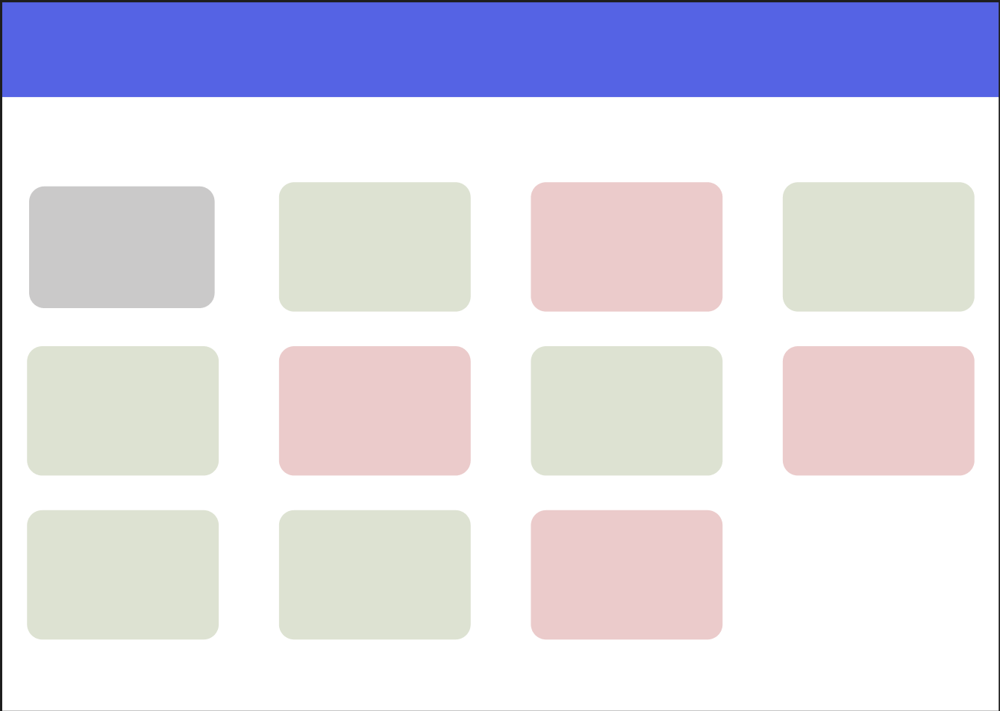
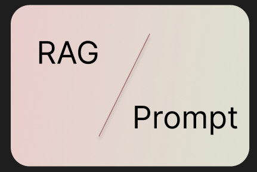

请根据以下详细说明，设计 evaluation page 的内容和交互：

1. evaluation page 分为两类评估：RAG 应用评估和 Prompt 评估。
2. 页面主要包含两部分：一是首页展示最近的评估结果，二是支持添加新的评估任务。
3. 首页以网格状排列多个卡片，每个卡片代表一个评估结果或新建评估入口。请使用 grid 或 MUI 的 Grid 组件实现。
4. 卡片样式说明：
  - RAG 评估卡片：背景色为 #EBCBCB（淡红色）。
  - Prompt 评估卡片：背景色为 #DDE2D2（淡绿色）。
  - 新建评估卡片：背景色为 #CAC9C9（淡灰色），中央有一个 MUI 的加号图标。
5. 新建评估卡片的交互：
  - 未悬停时，显示淡灰色背景和中央加号图标。
  - 悬停时，背景变为线性渐变（background: linear-gradient(95deg, #EBCBCB -13.14%, #DDE2D2 109.8%)），中央出现一条与渐变方向垂直的倾斜线（颜色 #A56F6F），线段左上方显示“RAG”，右下方显示“Prompt”。
  - 悬停在“RAG”文字上时，背景变为纯淡红色，斜线消失，“RAG”文字加深并有左到右的下划线。
  - 悬停在“Prompt”文字上时，背景变为纯淡绿色，斜线消失，“Prompt”文字加深并有右到左的下划线。
6. 点击“RAG”或“Prompt”文字时，弹出中央悬浮对话框或跳转到新页面，用于分步骤创建评估任务。请考虑使用适合分步操作的组件（如 Stepper）。
7. 除新建卡片外，其他卡片在桌面端支持鼠标跟踪的 3D 旋转动画（仅在桌面端生效，移动端不生效），动画在鼠标靠近卡片边缘或内部时触发。
8. 所有卡片适当添加阴影或滤镜，增强拟物化风格。

请按照上述规范进行页面和交互设计，并在必要时适当修改以增进交互。
