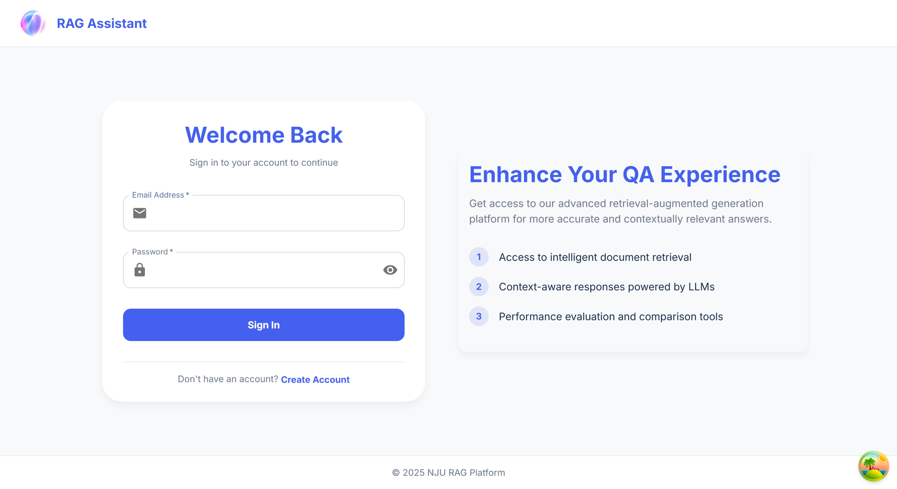
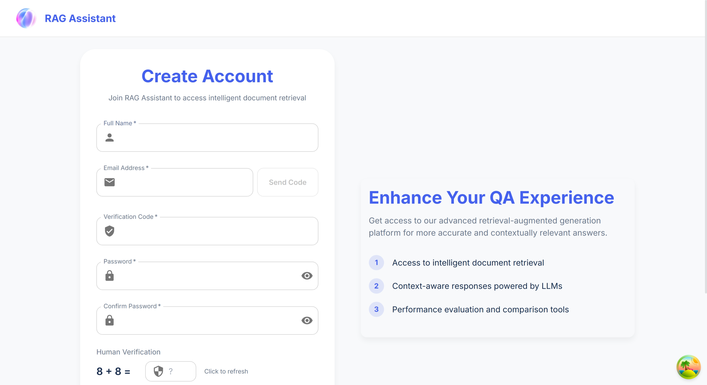
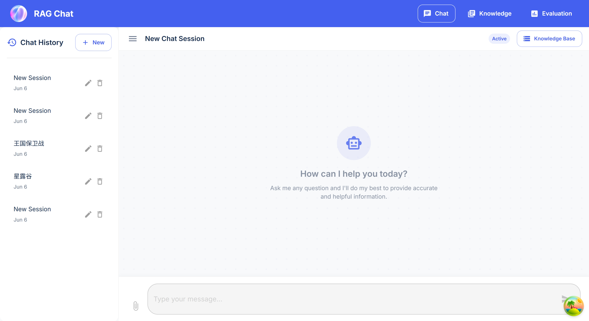
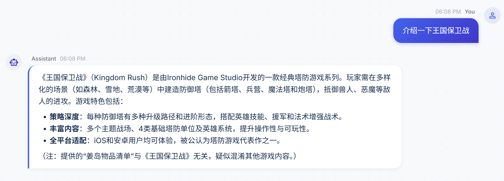
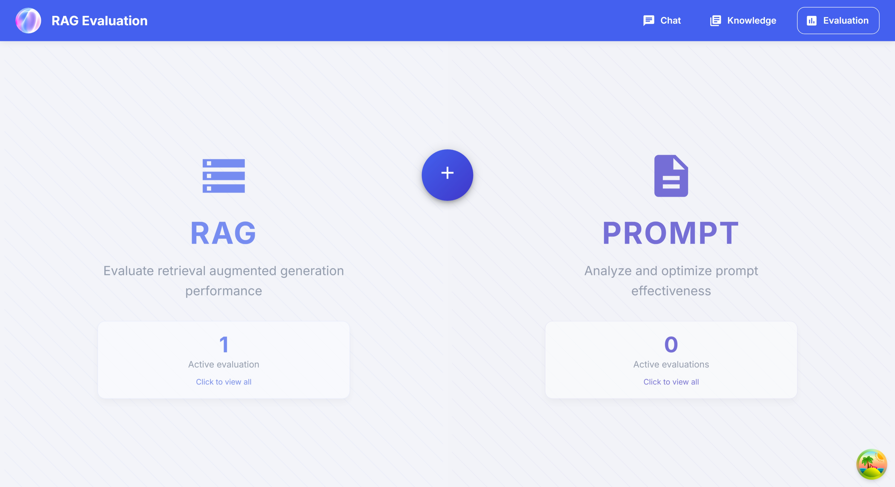

# 🤖 RAG Chat Application

<div align="center">


**一个基于React构建的高级检索增强生成(RAG)聊天平台**

[](https://www.typescriptlang.org/)
[](https://reactjs.org/)
[](https://mui.com/)
[](https://vitejs.dev/)

</div>

---

## 📋 目录

- [功能特性](#-功能特性)
- [界面预览](#-界面预览)
- [技术架构](#-技术架构)
- [快速开始](#-快速开始)
- [项目结构](#-项目结构)
- [API配置](#-api配置)
- [部署指南](#-部署指南)
- [常见问题](#-常见问题)
- [开发指南](#-开发指南)

---

## ✨ 功能特性

### 🔐 用户认证系统
- **安全登录**: 基于Token的身份验证
- **用户注册**: 完整的注册流程，包含邮箱验证
- **人机验证**: 数学验证码防止机器人注册
- **会话管理**: 自动token刷新和安全登出

### 💬 智能对话系统
- **多轮对话**: 支持上下文感知的连续对话
- **实时流式响应**: AI回复实时流式显示
- **会话历史**: 自动保存和管理聊天记录
- **消息管理**: 支持消息编辑、删除和重新生成

### 🧠 知识库管理
- **可视化管理**: 直观的知识源管理界面
- **多格式支持**: 支持多种文档格式上传
- **智能检索**: 基于向量数据库的语义检索
- **内容预览**: 实时预览知识库内容

### 📊 评估系统
- **RAG评估**: 多维度性能指标分析
- **提示词评估**: 提示词效果对比测试
- **性能监控**: 实时系统性能追踪
- **历史分析**: 长期趋势分析和优化建议

---

## 🖼️ 界面预览


*现代化的登录界面，支持用户注册和人机验证*


*清晰的聊天界面，支持历史记录侧边栏和实时对话*


*类似Windows资源管理器的知识库管理界面*


*综合的评估系统，支持多种评估类型*

<div align="center">

</div>

---

## 🏗️ 技术架构

### 前端技术栈
- **框架**: React 19 + TypeScript
- **构建工具**: Vite (快速开发和构建)
- **UI库**: Material-UI v7 (现代化组件库)
- **状态管理**: TanStack React Query (服务器状态管理)
- **路由**: React Router v7 (声明式路由)
- **动画**: Framer Motion (流畅的页面动画)
- **图表**: Chart.js + React Chart.js 2 (数据可视化)

### 开发工具
- **代码规范**: ESLint + TypeScript
- **测试框架**: Jest (单元测试)
- **包管理**: npm/yarn
- **版本控制**: Git

### 架构特点
- **模块化设计**: 组件、服务、hooks分离
- **类型安全**: 完整的TypeScript类型定义
- **响应式设计**: 支持多种设备尺寸
- **国际化准备**: 易于扩展多语言支持

---

## 🚀 快速开始

### 环境要求
- **Node.js**: 16.0+
- **npm**: 8.0+ 或 **yarn**: 1.22+
- **浏览器**: Chrome 88+, Firefox 85+, Safari 14+

### 安装步骤

1. **克隆项目**
```bash
git clone <repository-url>
cd rag-chat
```

2. **安装依赖**
```bash
npm install
# 或者使用 yarn
yarn install
```

3. **启动开发服务器**
```bash
npm run dev
# 或者使用 yarn
yarn dev
```

4. **访问应用**
```
http://localhost:5174
```

### 可用脚本

| 命令 | 描述 |
|------|------|
| `npm run dev` | 启动开发服务器 |
| `npm run build` | 构建生产版本 |
| `npm run preview` | 预览生产构建 |
| `npm run lint` | 运行代码检查 |
| `npm test` | 运行测试套件 |

---

## 📁 项目结构

```
rag-chat/
├── public/                 # 静态资源
│   └── icon.png           # 应用图标
├── src/
│   ├── components/        # React组件
│   │   ├── chat/         # 聊天相关组件
│   │   ├── login/        # 登录注册组件
│   │   ├── knowledge/    # 知识库组件
│   │   ├── evaluation/   # 评估系统组件
│   │   └── common/       # 通用组件
│   ├── hooks/            # 自定义Hooks
│   │   ├── auth/         # 认证相关hooks
│   │   ├── chat/         # 聊天相关hooks
│   │   └── common/       # 通用hooks
│   ├── services/         # API服务层
│   │   ├── auth/         # 认证服务
│   │   ├── chat/         # 聊天服务
│   │   └── http/         # HTTP客户端
│   ├── models/           # 数据模型
│   ├── pages/            # 页面组件
│   ├── routes/           # 路由配置
│   ├── store/            # 状态管理
│   ├── theme/            # 主题配置
│   └── utils/            # 工具函数
├── docs/                 # 项目文档
│   ├── images/           # 界面截图
│   └── *.md              # 技术文档
└── tests/                # 测试文件
```

---

## 🔧 API配置

### 代理配置
应用通过Vite代理将API请求转发到后端服务器。默认配置：

```typescript
// vite.config.ts
server: {
  proxy: {
    '/auth': 'https://home.si-qi.wang',
    '/rag': 'https://home.si-qi.wang',
    '/api': 'https://home.si-qi.wang'
  }
}
```

### API端点

| 服务 | 端点 | 描述 |
|------|------|------|
| 认证服务 | `/auth/` | 用户登录、注册、验证 |
| RAG服务 | `/rag/` | 对话生成和会话管理 |
| 知识库 | `/api/knowledge/` | 知识源管理 |
| 评估系统 | `/api/rag/` | 性能评估和分析 |

### 测试API连接

```bash
# 安装测试依赖
npm install node-fetch

# 运行连接测试
node src/test_api.js YOUR_AUTH_TOKEN
```

---

## 🐳 部署指南

### Docker部署

1. **构建镜像**
```bash
docker build -t rag-chat .
```

2. **运行容器**
```bash
docker run -p 80:80 rag-chat
```

### Docker Compose部署

```bash
cd dockerize
docker-compose up -d
```

### 生产环境配置

1. **构建生产版本**
```bash
npm run build
```

2. **配置环境变量**
```bash
# .env.production
VITE_API_BASE_URL=https://your-api-domain.com
VITE_APP_TITLE=RAG Chat
```

3. **部署到静态托管**
- Vercel
- Netlify
- GitHub Pages
- 自定义服务器

---

## ❓ 常见问题

### 🔐 认证相关

**Q: 登录后页面跳转回登录界面？**
A: 这通常是token过期或缓存问题。解决方案：
- 清除浏览器缓存和localStorage
- 检查网络连接
- 确认API服务器正常运行

**Q: 注册验证码收不到？**
A: 检查以下项目：
- 邮箱地址格式正确
- 垃圾邮件文件夹
- 网络连接稳定
- 等待60秒后重试

### 💬 聊天功能

**Q: 消息发送失败？**
A: 可能的原因：
- 会话已过期，请刷新页面
- 网络连接中断
- API服务器负载过高

**Q: 流式回复中断？**
A: 检查浏览器控制台错误信息：
- 网络连接稳定性
- API支持Server-Sent Events
- 防火墙设置

### 🧠 知识库管理

**Q: 文件上传失败？**
A: 确认：
- 文件格式支持
- 文件大小限制
- 网络连接稳定
- 存储空间充足

---

## 👨‍💻 开发指南

### 本地开发环境

1. **安装依赖**
```bash
npm install
```

2. **启动开发模式**
```bash
npm run dev
```

3. **代码规范检查**
```bash
npm run lint
```

### 项目规范

- **组件命名**: PascalCase (如: `ChatMessage`)
- **文件命名**: kebab-case (如: `chat-message.tsx`)
- **函数命名**: camelCase (如: `sendMessage`)
- **常量命名**: UPPER_SNAKE_CASE (如: `API_BASE_URL`)

### 提交规范

```bash
# 功能开发
git commit -m "feat: 添加用户注册功能"

# 问题修复
git commit -m "fix: 修复登录页面跳转问题"

# 文档更新
git commit -m "docs: 更新README文档"
```

### 测试指南

```bash
# 运行所有测试
npm test

# 运行特定测试
npm run test:unit
npm run test:integration
```

---

## 📄 许可证

本项目采用 MIT 许可证 - 详见 [LICENSE](LICENSE) 文件

---

## 🤝 贡献指南

1. Fork 本项目
2. 创建功能分支 (`git checkout -b feature/amazing-feature`)
3. 提交更改 (`git commit -m 'feat: 添加新功能'`)
4. 推送到分支 (`git push origin feature/amazing-feature`)
5. 创建 Pull Request

---

## 📞 联系我们

- **项目主页**: [GitHub Repository](https://github.com/your-username/rag-chat)
- **问题反馈**: [Issues](https://github.com/your-username/rag-chat/issues)
- **讨论交流**: [Discussions](https://github.com/your-username/rag-chat/discussions)

---

<div align="center">

**⭐ 如果这个项目对你有帮助，请给个Star支持一下！ ⭐**

Made with ❤️ by the RAG Chat Team

</div>
```
